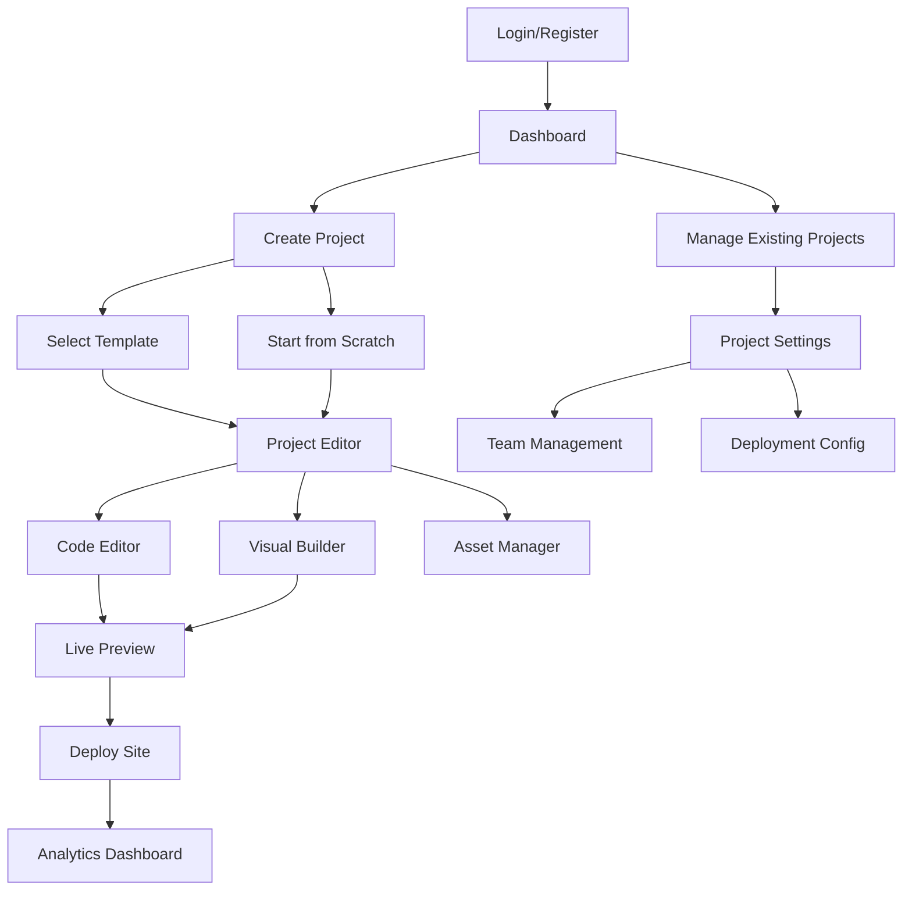

# Static Website Management Platform - Product Requirements Document

## 1. Product Overview

A comprehensive static website management platform that enables users to create, edit, deploy, and manage static HTML/CSS/JS websites through a professional-grade interface with multi-user collaboration capabilities.

The platform transforms simple static site creation into a full-featured content management system, targeting web developers, designers, and content creators who need powerful tools for building and managing static websites without complex server infrastructure.

This solution addresses the gap between basic HTML editors and complex CMS platforms, providing enterprise-grade features while maintaining the simplicity and performance benefits of static websites.

## 2. Core Features

### 2.1 User Roles

| Role | Registration Method | Core Permissions |
|------|---------------------|------------------|
| Admin | System invitation | Full system access, user management, global settings |
| Project Owner | Email registration | Create projects, manage team members, deployment settings |
| Editor | Project invitation | Edit content, manage pages, upload assets |
| Viewer | Project invitation | View projects, preview sites, download builds |

### 2.2 Feature Module

Our Static Website Management Platform consists of the following main pages:

1. **Authentication Pages**: login, registration, password reset, email verification
2. **Dashboard**: project overview, recent activity, analytics summary, quick actions
3. **Project Management**: project creation, settings, team management, deployment configuration
4. **Editor Interface**: code editor, visual builder, live preview, file management
5. **Asset Manager**: file uploads, image optimization, asset organization, CDN management
6. **Template Gallery**: pre-built templates, custom template creation, template marketplace
7. **Deployment Center**: build management, deployment history, domain configuration
8. **Analytics Dashboard**: performance metrics, visitor statistics, SEO insights
9. **Settings & Profile**: user preferences, account management, billing information

### 2.3 Page Details

| Page Name | Module Name | Feature description |
|-----------|-------------|---------------------|
| Authentication Pages | Login Form | Authenticate users with email/password, social login options, remember me functionality |
| Authentication Pages | Registration Form | Create new accounts with email verification, password strength validation, terms acceptance |
| Authentication Pages | Password Reset | Send reset emails, validate tokens, update passwords securely |
| Dashboard | Project Overview | Display project cards with thumbnails, status indicators, last modified dates |
| Dashboard | Activity Feed | Show recent changes, team activities, deployment notifications |
| Dashboard | Quick Actions | Create new project, access recent files, view analytics summary |
| Dashboard | Analytics Summary | Display key metrics, visitor counts, performance scores |
| Project Management | Project Creation | Initialize new projects with templates, configure basic settings, invite team members |
| Project Management | Project Settings | Manage project metadata, SEO settings, custom domains, deployment targets |
| Project Management | Team Management | Invite collaborators, assign roles, manage permissions, activity tracking |
| Editor Interface | Code Editor | Monaco editor with syntax highlighting, auto-completion, error detection, multi-file tabs |
| Editor Interface | Visual Builder | Drag-and-drop components, real-time preview, responsive design tools |
| Editor Interface | Live Preview | Real-time rendering, device simulation, responsive breakpoint testing |
| Editor Interface | File Explorer | Navigate project structure, create/delete files, organize assets |
| Asset Manager | File Upload | Drag-and-drop uploads, batch processing, file type validation, progress tracking |
| Asset Manager | Image Optimization | Automatic compression, WebP conversion, responsive image generation |
| Asset Manager | Asset Organization | Folder structure, tagging system, search functionality, usage tracking |
| Template Gallery | Template Browser | Browse categorized templates, preview functionality, rating system |
| Template Gallery | Template Creation | Save custom templates, share with team, publish to marketplace |
| Deployment Center | Build Management | Trigger builds, view build logs, manage build configurations |
| Deployment Center | Deployment History | Track deployment versions, rollback functionality, deployment status |
| Deployment Center | Domain Configuration | Custom domain setup, SSL certificate management, DNS configuration |
| Analytics Dashboard | Performance Metrics | Page load times, Lighthouse scores, optimization suggestions |
| Analytics Dashboard | Visitor Statistics | Traffic analytics, user behavior, geographic data |
| Analytics Dashboard | SEO Insights | Search rankings, meta tag analysis, sitemap status |
| Settings & Profile | User Preferences | Theme selection, editor settings, notification preferences |
| Settings & Profile | Account Management | Profile information, password changes, two-factor authentication |

## 3. Core Process

**Admin Flow:**
1. Admin logs into the system and accesses the admin dashboard
2. Admin can create new user accounts, manage system settings, and monitor platform usage
3. Admin reviews and approves template submissions for the marketplace
4. Admin manages global deployment configurations and monitors system health

**Project Owner Flow:**
1. User registers/logs in and accesses the main dashboard
2. User creates a new project by selecting a template or starting from scratch
3. User configures project settings including SEO metadata and deployment targets
4. User invites team members and assigns appropriate roles
5. User uses the editor interface to create and modify pages
6. User uploads and manages assets through the asset manager
7. User previews the site and triggers deployments
8. User monitors analytics and performance metrics

**Editor Flow:**
1. Editor receives invitation and joins the project
2. Editor accesses the editor interface to modify content
3. Editor uploads assets and creates new pages as needed
4. Editor collaborates with team members through real-time editing
5. Editor previews changes and submits for review/deployment

**Viewer Flow:**
1. Viewer receives project access and logs in
2. Viewer can browse project pages and preview the live site
3. Viewer can download builds and access read-only analytics

## 4. User Interface Design

### 4.1 Design Style

- **Primary Colors**: Deep blue (#1e40af) for primary actions, light blue (#3b82f6) for secondary elements
- **Secondary Colors**: Gray scale (#f8fafc to #1e293b) for backgrounds and text, green (#10b981) for success states, red (#ef4444) for errors
- **Button Style**: Rounded corners (8px), subtle shadows, hover animations with color transitions
- **Font**: Inter font family with 14px base size, 16px for body text, 24px+ for headings
- **Layout Style**: Card-based design with clean spacing, sidebar navigation, responsive grid layouts
- **Icons**: Lucide React icons with consistent 20px size, outline style for better clarity

### 4.2 Page Design Overview

| Page Name | Module Name | UI Elements |
|-----------|-------------|-------------|
| Dashboard | Project Grid | Card layout with project thumbnails, gradient backgrounds, hover effects with scale transforms |
| Dashboard | Activity Feed | Timeline design with icons, timestamps, clean typography with 16px line height |
| Editor Interface | Code Editor | Dark theme Monaco editor, tabbed interface, split-screen layout with resizable panels |
| Editor Interface | Visual Builder | Drag-and-drop zones with dotted borders, component palette sidebar, property panels |
| Asset Manager | File Grid | Thumbnail grid with overlay actions, upload dropzone with animated borders |
| Template Gallery | Template Cards | Large preview images, category filters, star ratings with yellow (#fbbf24) accent |
| Analytics Dashboard | Metrics Cards | Clean white cards with colored accent borders, chart visualizations, number animations |
| Settings | Form Layout | Two-column layout, grouped form sections, toggle switches with blue accent colors |

### 4.3 Responsiveness

The platform is designed with a desktop-first approach but includes comprehensive mobile adaptations. Touch interaction optimization includes larger tap targets (44px minimum), swipe gestures for navigation, and optimized form inputs for mobile keyboards. Responsive breakpoints at 768px (tablet) and 1024px (desktop) ensure optimal viewing across all devices.