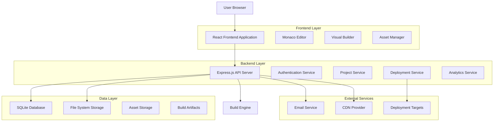
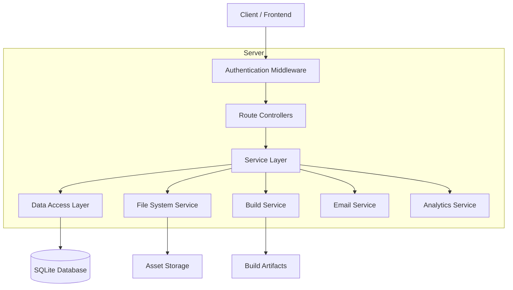
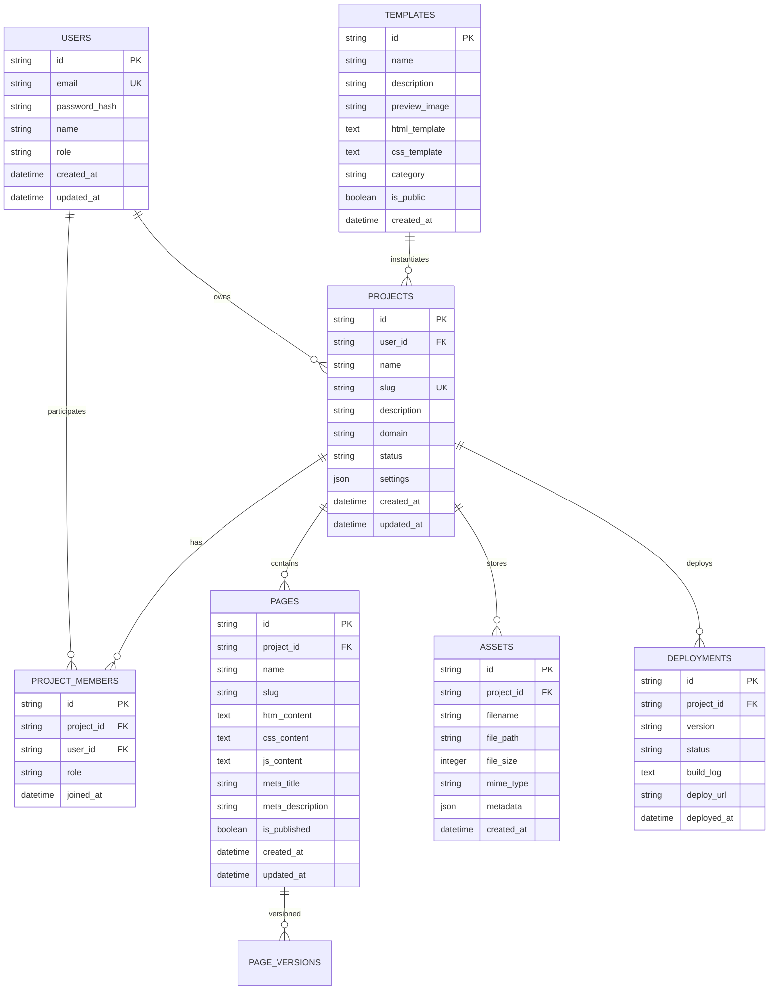

# Static Website Management Platform - Technical Architecture Document

## 1. Architecture Design



## 2. Technology Description

* Frontend: React\@18 + TypeScript\@5 + Vite\@5 + Tailwind CSS\@3 + Zustand\@4

* Backend: Node.js\@20 + Express.js\@4 + Prisma\@5 + SQLite\@3

* Editor: Monaco Editor\@0.45 + React Monaco Editor\@4

* Authentication: JWT + bcrypt + express-rate-limit

* File Processing: multer + sharp + archiver

* Build Tools: esbuild + postcss + autoprefixer

## 3. Route Definitions

| Route                           | Purpose                                                                                        |
| ------------------------------- | ---------------------------------------------------------------------------------------------- |
| /                               | Landing page with platform overview and login/register options                                 |
| /login                          | User authentication page with email/password and social login                                  |
| /register                       | User registration with email verification workflow, can be disabled by "DISABLE\_REGISTER" env |
| /dashboard                      | Main dashboard showing projects, activity feed, and quick actions                              |
| /projects/:id                   | Individual project management and settings page                                                |
| /editor/:projectId              | Main editor interface with code editor and visual builder                                      |
| /editor/:projectId/page/:pageId | Specific page editing within a project                                                         |
| /assets/:projectId              | Asset management interface for file uploads and organization                                   |
| /templates                      | Template gallery with browsing and preview functionality                                       |
| /analytics/:projectId           | Analytics dashboard with performance and visitor metrics                                       |
| /settings                       | User profile and account settings management                                                   |
| /admin                          | Admin panel for user management and system configuration                                       |

## 4. API Definitions

### 4.1 Core API

Authentication related

```
POST /api/auth/login
```

Request:

| Param Name | Param Type | isRequired | Description                |
| ---------- | ---------- | ---------- | -------------------------- |
| email      | string     | true       | User email address         |
| password   | string     | true       | User password (plain text) |
| remember   | boolean    | false      | Remember login session     |

Response:

| Param Name | Param Type | Description              |
| ---------- | ---------- | ------------------------ |
| success    | boolean    | Authentication status    |
| token      | string     | JWT access token         |
| user       | object     | User profile information |

Example

```json
{
  "email": "user@example.com",
  "password": "securePassword123",
  "remember": true
}
```

User registration

```
POST /api/auth/register
```

Request:

| Param Name | Param Type | isRequired | Description                 |
| ---------- | ---------- | ---------- | --------------------------- |
| name       | string     | true       | Full name of user           |
| email      | string     | true       | Email address               |
| password   | string     | true       | Password (min 8 characters) |

Project management

```
GET /api/projects
POST /api/projects
PUT /api/projects/:id
DELETE /api/projects/:id
```

Page management

```
GET /api/projects/:projectId/pages
POST /api/projects/:projectId/pages
PUT /api/projects/:projectId/pages/:pageId
DELETE /api/projects/:projectId/pages/:pageId
```

Asset management

```
POST /api/projects/:projectId/assets
GET /api/projects/:projectId/assets
DELETE /api/assets/:assetId
```

Build and deployment

```
POST /api/projects/:projectId/build
GET /api/projects/:projectId/deployments
POST /api/projects/:projectId/deploy
```

## 5. Server Architecture Diagram



## 6. Data Model

### 6.1 Data Model Definition



### 6.2 Data Definition Language

User Table (users)

```sql
-- Create users table
CREATE TABLE users (
    id TEXT PRIMARY KEY DEFAULT (lower(hex(randomblob(16)))),
    email TEXT UNIQUE NOT NULL,
    password_hash TEXT NOT NULL,
    name TEXT NOT NULL,
    role TEXT DEFAULT 'user' CHECK (role IN ('admin', 'user')),
    email_verified BOOLEAN DEFAULT FALSE,
    created_at DATETIME DEFAULT CURRENT_TIMESTAMP,
    updated_at DATETIME DEFAULT CURRENT_TIMESTAMP
);

-- Create indexes
CREATE INDEX idx_users_email ON users(email);
CREATE INDEX idx_users_role ON users(role);
```

Projects Table (projects)

```sql
-- Create projects table
CREATE TABLE projects (
    id TEXT PRIMARY KEY DEFAULT (lower(hex(randomblob(16)))),
    user_id TEXT NOT NULL,
    name TEXT NOT NULL,
    slug TEXT UNIQUE NOT NULL,
    description TEXT,
    domain TEXT,
    status TEXT DEFAULT 'draft' CHECK (status IN ('draft', 'published', 'archived')),
    settings JSON DEFAULT '{}',
    created_at DATETIME DEFAULT CURRENT_TIMESTAMP,
    updated_at DATETIME DEFAULT CURRENT_TIMESTAMP,
    FOREIGN KEY (user_id) REFERENCES users(id) ON DELETE CASCADE
);

-- Create indexes
CREATE INDEX idx_projects_user_id ON projects(user_id);
CREATE INDEX idx_projects_slug ON projects(slug);
CREATE INDEX idx_projects_status ON projects(status);
```

Project Members Table (project\_members)

```sql
-- Create project_members table
CREATE TABLE project_members (
    id TEXT PRIMARY KEY DEFAULT (lower(hex(randomblob(16)))),
    project_id TEXT NOT NULL,
    user_id TEXT NOT NULL,
    role TEXT DEFAULT 'viewer' CHECK (role IN ('owner', 'editor', 'viewer')),
    joined_at DATETIME DEFAULT CURRENT_TIMESTAMP,
    FOREIGN KEY (project_id) REFERENCES projects(id) ON DELETE CASCADE,
    FOREIGN KEY (user_id) REFERENCES users(id) ON DELETE CASCADE,
    UNIQUE(project_id, user_id)
);

-- Create indexes
CREATE INDEX idx_project_members_project_id ON project_members(project_id);
CREATE INDEX idx_project_members_user_id ON project_members(user_id);
```

Pages Table (pages)

```sql
-- Create pages table
CREATE TABLE pages (
    id TEXT PRIMARY KEY DEFAULT (lower(hex(randomblob(16)))),
    project_id TEXT NOT NULL,
    name TEXT NOT NULL,
    slug TEXT NOT NULL,
    html_content TEXT DEFAULT '',
    css_content TEXT DEFAULT '',
    js_content TEXT DEFAULT '',
    meta_title TEXT,
    meta_description TEXT,
    is_published BOOLEAN DEFAULT FALSE,
    created_at DATETIME DEFAULT CURRENT_TIMESTAMP,
    updated_at DATETIME DEFAULT CURRENT_TIMESTAMP,
    FOREIGN KEY (project_id) REFERENCES projects(id) ON DELETE CASCADE,
    UNIQUE(project_id, slug)
);

-- Create indexes
CREATE INDEX idx_pages_project_id ON pages(project_id);
CREATE INDEX idx_pages_slug ON pages(project_id, slug);
CREATE INDEX idx_pages_published ON pages(is_published);
```

Assets Table (assets)

```sql
-- Create assets table
CREATE TABLE assets (
    id TEXT PRIMARY KEY DEFAULT (lower(hex(randomblob(16)))),
    project_id TEXT NOT NULL,
    filename TEXT NOT NULL,
    file_path TEXT NOT NULL,
    file_size INTEGER NOT NULL,
    mime_type TEXT NOT NULL,
    metadata JSON DEFAULT '{}',
    created_at DATETIME DEFAULT CURRENT_TIMESTAMP,
    FOREIGN KEY (project_id) REFERENCES projects(id) ON DELETE CASCADE
);

-- Create indexes
CREATE INDEX idx_assets_project_id ON assets(project_id);
CREATE INDEX idx_assets_mime_type ON assets(mime_type);
```

Templates Table (templates)

```sql
-- Create templates table
CREATE TABLE templates (
    id TEXT PRIMARY KEY DEFAULT (lower(hex(randomblob(16)))),
    name TEXT NOT NULL,
    description TEXT,
    preview_image TEXT,
    html_template TEXT NOT NULL,
    css_template TEXT DEFAULT '',
    category TEXT DEFAULT 'general',
    is_public BOOLEAN DEFAULT FALSE,
    created_at DATETIME DEFAULT CURRENT_TIMESTAMP
);

-- Create indexes
CREATE INDEX idx_templates_category ON templates(category);
CREATE INDEX idx_templates_public ON templates(is_public);
```

Deployments Table (deployments)

```sql
-- Create deployments table
CREATE TABLE deployments (
    id TEXT PRIMARY KEY DEFAULT (lower(hex(randomblob(16)))),
    project_id TEXT NOT NULL,
    version TEXT NOT NULL,
    status TEXT DEFAULT 'pending' CHECK (status IN ('pending', 'building', 'success', 'failed')),
    build_log TEXT,
    deploy_url TEXT,
    deployed_at DATETIME DEFAULT CURRENT_TIMESTAMP,
    FOREIGN KEY (project_id) REFERENCES projects(id) ON DELETE CASCADE
);

-- Create indexes
CREATE INDEX idx_deployments_project_id ON deployments(project_id);
CREATE INDEX idx_deployments_status ON deployments(status);
CREATE INDEX idx_deployments_deployed_at ON deployments(deployed_at DESC);
```

Initial Data

```sql
-- Insert default templates
INSERT INTO templates (name, description, html_template, css_template, category, is_public) VALUES
('Blank Page', 'Start with a clean slate', '<!DOCTYPE html><html><head><title>New Page</title></head><body><h1>Welcome</h1></body></html>', '', 'basic', TRUE),
('Business Landing', 'Professional business landing page', '<!DOCTYPE html><html><head><title>Business</title></head><body><header><h1>Your Business</h1></header><main><section><h2>About Us</h2><p>We provide excellent services.</p></section></main></body></html>', 'body { font-family: Arial, sans-serif; margin: 0; padding: 20px; }', 'business', TRUE),
('Portfolio', 'Showcase your work', '<!DOCTYPE html><html><head><title>Portfolio</title></head><body><header><h1>My Portfolio</h1></header><main><div class="gallery"><div class="item">Project 1</div></div></main></body></html>', '.gallery { display: grid; grid-template-columns: repeat(auto-fit, minmax(300px, 1fr)); gap: 20px; }', 'portfolio', TRUE);
```

